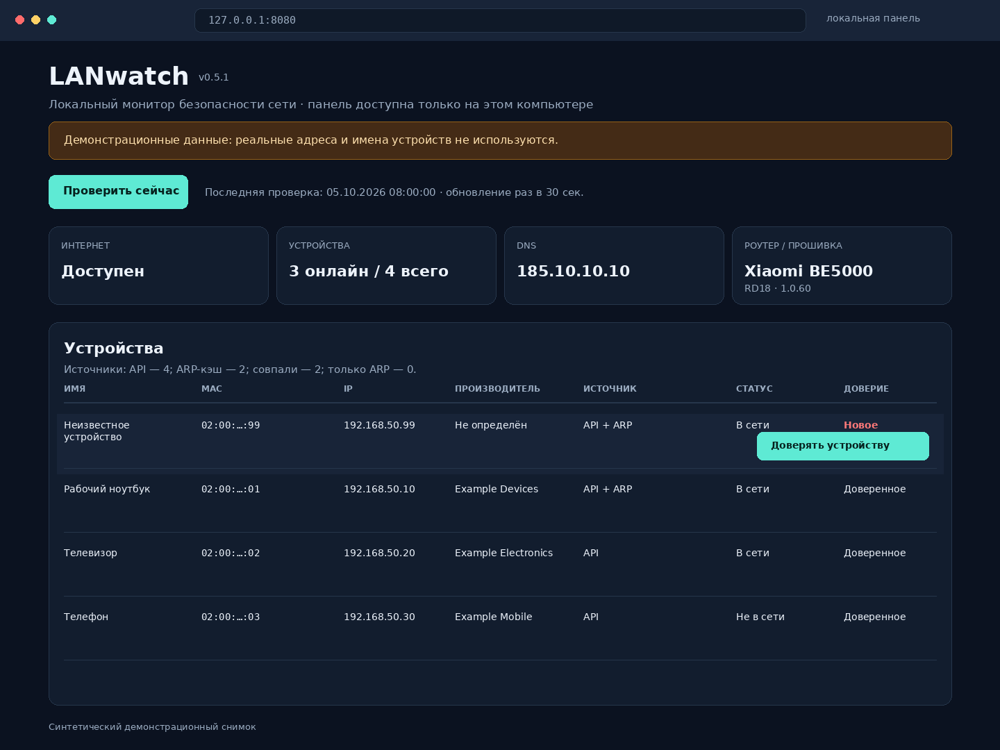
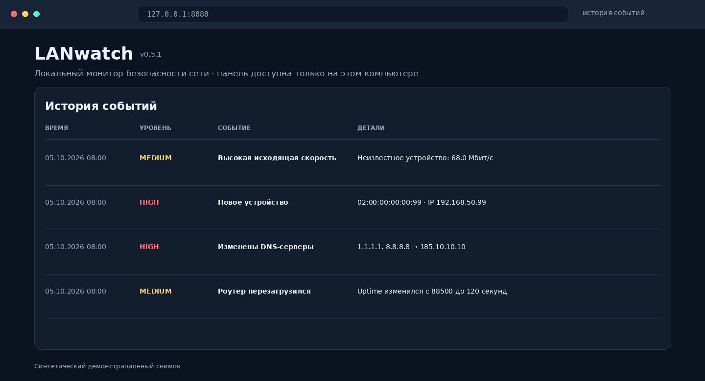
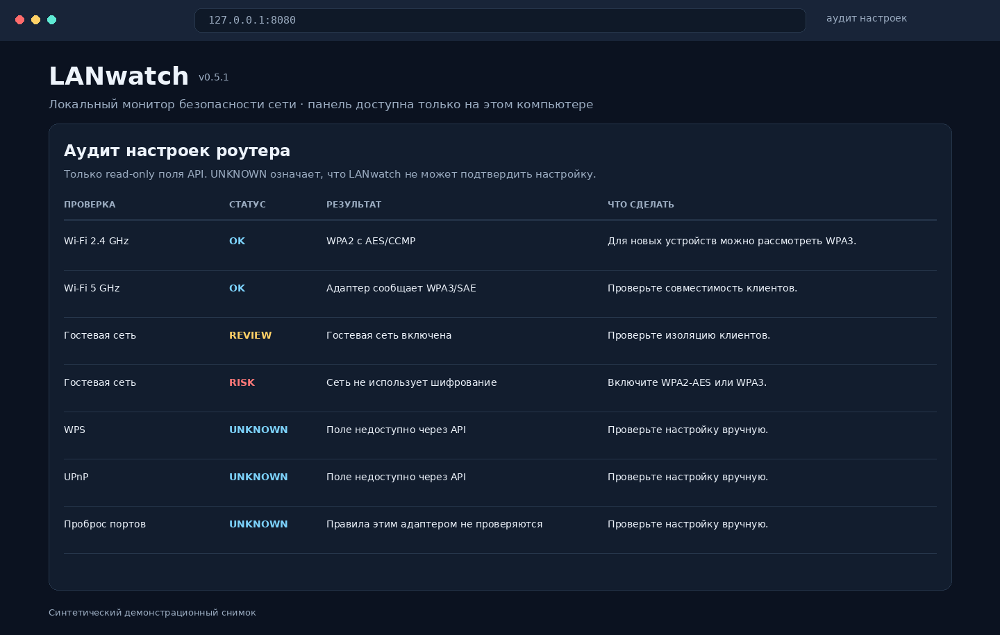
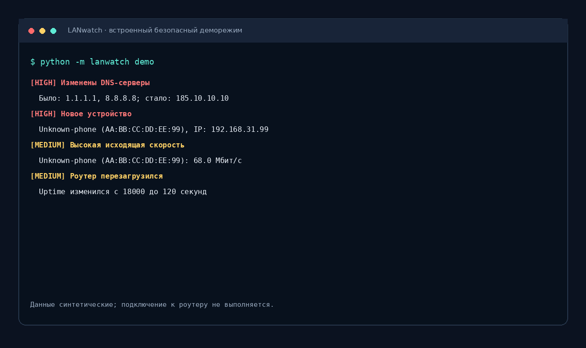
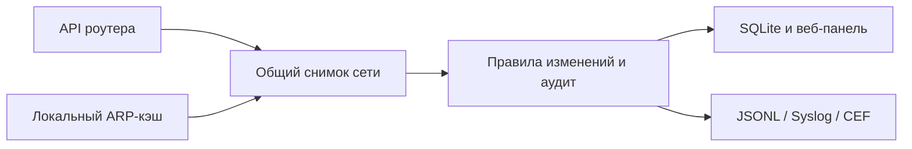

# LANwatch

[](https://github.com/B1MAS/lanwatch/actions/workflows/tests.yml)


Локальный open-source монитор состояния и безопасности небольшой сети. Он
фиксирует появление новых устройств, изменение DNS, потерю WAN, перезагрузку
роутера и другие заметные изменения, а затем показывает их в терминале и
локальной веб-панели. Панель слушает только `127.0.0.1`: она не публикуется в
интернете и не доступна с других устройств сети.

LANwatch использует общую схему снимков сети и отдельные адаптеры роутеров.
Поддерживаются автоматическое определение Xiaomi MiWiFi API и экспериментальный
адаптер OpenWrt ubus. Xiaomi MiWiFi BE5000 (RD18), прошивка 1.0.60, проверен
пользователем. OpenWrt адаптер покрыт офлайн-тестами, но пока не проверен на
реальном устройстве. Другие OEM-прошивки и модели не считаются совместимыми,
пока для них не добавлен отдельный адаптер.

## Интерфейс







Все изображения выше созданы на синтетических демонстрационных данных. В них
нет адресов, имён устройств или других сведений из реальной сети.

Встроенное демо можно запустить без роутера и пароля:

```text
python -m lanwatch demo
```



## Как устроен поток данных



LANwatch работает в режиме чтения: адаптеры получают доступные сведения,
приводят их к общей схеме, а правила сравнивают новый снимок с доверенной базой
и предыдущим состоянием. Возможности всегда ограничены данными, которые
предоставляет конкретный роутер.

## Возможности

- замечает новые и пропавшие устройства;
- проверяет доступность WAN, изменения DNS, перезагрузку и смену прошивки;
- отмечает ограничение доступа устройства в интернет и высокую исходящую скорость;
- хранит локальную историю событий;
- позволяет подтвердить новое устройство, не пересоздавая всю доверенную базу;
- показывает состояние сети в терминале и в локальной веб-панели;
- выполняет консервативный аудит некоторых Wi-Fi настроек и явно помечает недоступные API-проверки как UNKNOWN;
- экспортирует историю событий в JSONL, syslog или CEF для локального импорта в SIEM;
- дополняет устройства локальным ARP-кэшем ОС и показывает источник каждой записи;
- определяет производителя MAC по локальной IEEE OUI базе;
- хранит историю снимков в SQLite и показывает краткие графики;
- поддерживает opt-in webhook и Telegram уведомления с минимальным набором полей.

Это не полноценная SIEM и не анализатор всего сетевого трафика. Проект видит
только те данные, которые предоставляет API роутера. Он не заявляет, что умеет
обнаруживать вредоносное ПО, сканирование портов или все атаки.

## Требования и установка

Требуется Python 3.11 или новее; сторонние runtime-пакеты не нужны. Рекомендуется
использовать поддерживаемую версию Python с актуальными исправлениями
безопасности.

Клонируйте репозиторий и проверьте встроенное демо:

```sh
git clone https://github.com/B1MAS/lanwatch.git
cd lanwatch
python -m lanwatch demo
```

Либо распакуйте архив, откройте PowerShell/терминал в папке проекта и выполните:

```text
python -m lanwatch demo
python -m lanwatch enroll
python -m lanwatch check
```

### Установщики

Для Windows откройте PowerShell в папке проекта:

```powershell
powershell -ExecutionPolicy Bypass -File .\install.ps1
```

Для Kali/Debian/Ubuntu:

```sh
chmod +x install.sh
./install.sh
```

Установщик создаёт пользовательское Python-окружение; root и права
администратора не нужны. Установка не меняет роутер и не включает мониторинг
сама. Установщики не вызывают `pip` и не требуют доступа в интернет.
Удалить программу можно через `uninstall.ps1` или `./uninstall.sh`; папки
пользовательских данных не удаляются.

Установленный launcher принимает те же команды: в Windows используйте путь,
который вывел установщик (`...\Programs\LANwatch\lanwatch.cmd`), в Linux —
`~/.local/bin/lanwatch`, например `~/.local/bin/lanwatch web`.

`enroll` создаёт начальную доверенную базу устройств и DNS. Пароль панели
роутера вводится скрыто и не сохраняется. Адаптер по умолчанию определяется
автоматически по локальному API до запроса пароля. Адрес по умолчанию —
`http://192.168.31.1`; для другого локального IP:

```text
python -m lanwatch enroll --router http://192.168.1.1
```

Если автоопределение не сработало, адаптер можно указать явно:

```text
python -m lanwatch enroll --adapter miwifi --router http://192.168.31.1
python -m lanwatch enroll --adapter openwrt --router https://192.168.1.1
```

Для OpenWrt используйте отдельную учётную запись с ограниченным read-only ACL
для методов `system.board`, `system.info`, `network.interface.wan status` и
`dhcp ipv4leases`. Набор методов зависит от установленных компонентов и ACL.
LANwatch не настраивает роутер, не устанавливает пакеты и не просит root-доступ.
См. [официальную документацию OpenWrt по ubus, RPC-сессиям и DHCP-арендам](#openwrt-и-ограничения-доступа).

По умолчанию для OpenWrt обязателен HTTPS, потому что HTTP передаёт пароль
открытым текстом по локальной сети. Только для изолированной доверенной LAN
можно явно разрешить HTTP:

```text
python -m lanwatch enroll --adapter openwrt --router http://192.168.1.1 --allow-insecure-http
```

Имя пользователя можно задать через `OPENWRT_USERNAME`; пароль вводится скрыто.
Для автоматизированного режима допускается переменная `OPENWRT_PASSWORD`, но
интерактивный ввод предпочтительнее. Сессия RPC хранится только в памяти и
истекает на стороне rpcd; операции чтения ограничены allowlist’ом в адаптере.

### Безопасный отчёт для issue

Если хотите помочь добавить поддержку модели, сформируйте минимальную
диагностику и вручную проверьте JSON перед публикацией:

```text
python -m lanwatch probe --router http://192.168.1.1
```

Команда создаёт `lanwatch-probe.json` без обращения к данным устройств и без
авторизации. Файл содержит только версии LANwatch/Python, ОС, результат
определения адаптера и список возможностей. В нём намеренно нет IP роутера,
MAC/IP устройств, их имён, пароля, токена, ответов API и локального пути.
Чтобы сохранить в другое место, добавьте `--output путь-к-файлу`. Файл не
отправляется автоматически; приложите его к GitHub issue только после проверки.

Проверка в непрерывном режиме:

```text
python -m lanwatch monitor --interval 30
```

### Аудит, экспорт и уведомления

Read-only аудит доступных настроек:

```text
python -m lanwatch audit --adapter miwifi
```

Аудит не меняет настройки роутера. Для Xiaomi он использует локальный
reverse-engineered endpoint, если прошивка его предоставляет. SSID и пароль
Wi-Fi не сохраняются. WPS, UPnP, проброс портов, удалённое управление, DHCP и
администраторы в текущих адаптерах не подтверждены и поэтому показываются как
`UNKNOWN`, а не как безопасные.

Сохранённые события можно выгрузить:

```text
python -m lanwatch export --format jsonl --output lanwatch-events.jsonl
python -m lanwatch export --format syslog --output lanwatch-events.log
python -m lanwatch export --format cef --output lanwatch-events.cef
```

Экспорт остаётся локальным; LANwatch не открывает сетевой syslog-порт и не
отправляет данные в Wazuh сам. JSONL подходит как локальный источник `json`
для Wazuh `localfile`. Экспорт событий может содержать MAC/IP и имена устройств,
поэтому просмотрите файл перед пересылкой или публикацией.

Для постоянной передачи новых событий в локальный файл, который может читать
агент Wazuh:

```text
python -m lanwatch monitor --wazuh-jsonl /path/to/lanwatch-events.jsonl
```

В `docs/wazuh/` есть decoder, правила и конфигурационный пример `localfile`.
Настройте путь и права чтения под свою установку Wazuh; перед применением
проверьте примеры через `wazuh-logtest`. Сверяйтесь с [документацией Wazuh по
JSON decoder](https://documentation.wazuh.com/current/user-manual/ruleset/decoders/json-decoder.html)
и [сбору JSON-файлов через localfile](https://documentation.wazuh.com/current/user-manual/reference/ossec-conf/localfile.html).

Уведомления по умолчанию выключены. Явный `--webhook-url https://...` для
`check`, `monitor` или `web` отправляет только уровень, тип и заголовок новых
событий; IP, MAC и подробности не включаются. Для Telegram добавьте
`--telegram-notifications` и задайте `LANWATCH_TELEGRAM_BOT_TOKEN` и
`LANWATCH_TELEGRAM_CHAT_ID` в окружении. Сообщение содержит уровень и заголовок.
Оба способа отправляют выбранные метаданные внешнему сервису, поэтому применяйте
их только если такая передача вам подходит. Для webhook требуется HTTPS
(исключение — HTTP на loopback).

### ARP-кэш и производитель MAC

LANwatch читает только существующую neighbor/ARP таблицу этой ОС. Это пассивное
чтение: подсеть не сканируется, пакеты устройствам не отправляются, root не
требуется. Записи кэша могут быть неполными или устаревшими; устройства,
найденные только там, отображаются как «статус не подтверждён» и не создают
событие нового устройства. Отключить это можно флагом `--no-arp-neighbors`.

Для локального определения производителей загрузите публичный IEEE MA-L/OUI
справочник отдельной командой:

```text
python -m lanwatch oui-update
```

Скачивается CSV реестра IEEE. После этого поиск работает локально; MAC-адреса
никуда не отправляются. У рандомизированных MAC производителя может не быть.
Источник: [IEEE MA-L / OUI registry](https://standards.ieee.org/products-programs/regauth/oui/).

### Фоновые задачи

Шаблоны для systemd user service и Windows Task Scheduler находятся в `docs/`.
Оба требуют заранее заданный `MIWIFI_PASSWORD`; не помещайте пароль в командную
строку или unit-файл. Переменная окружения хранится в открытом виде в контексте
пользователя, поэтому для постоянного сервиса используйте только защищённую
учётную запись и файл с ограниченными правами. Фоновые шаблоны — примеры, их
нужно адаптировать под фактические пути и проверить перед запуском.

Шаблон read-only адаптера и матрица совместимости: `docs/ADAPTER_TEMPLATE.py`
и `docs/COMPATIBILITY.md`.

Локальная веб-панель:

```text
python -m lanwatch web --interval 30
```

Откройте в браузере адрес, который появится в терминале: обычно
`http://127.0.0.1:8080`. Остановить сервер можно сочетанием `Ctrl+C`.
Проверка идёт автоматически с заданным интервалом; кнопку «Проверить сейчас»
можно использовать для немедленного снимка. Кнопка доверия активна только для
устройства, которое сейчас видно онлайн.

Порт можно изменить, например:

```text
python -m lanwatch web --port 8090
```

Даже если указать `--host 0.0.0.0`, запуск будет отклонён: панель намеренно
ограничена IPv4 loopback и не открывается всему Wi-Fi.

## Состояние и конфиденциальность

Локальные данные находятся в `.lanwatch/`: доверенная база, последний снимок,
SQLite история и локальная OUI база. Для Linux права на каталог и файлы
ограничиваются владельцем (`0700`/`0600`). Старые JSON-события и последний
снимок импортируются при первом запуске новой версии. Состояние старой версии
из `.miwifi-sentinel/` копируется, если новая папка ещё не существует.

Пароль и токен авторизации не записываются на диск. Не задавайте пароль в
командной строке: он может попасть в историю оболочки или список процессов.
Клиент принимает только IP-адреса локальной сети и не следует перенаправлениям.
По умолчанию LANwatch не отправляет сетевые данные наружу. Отдельные команды
`oui-update`, webhook и Telegram имеют описанную выше сетевую передачу.
Не запускайте панель на недоверенном компьютере или в общей учётной записи.

Веб-панель построена на стандартном `http.server` Python без сторонних
зависимостей. Это небольшой локальный интерфейс, а не production-веб-сервер.
Защита включает loopback-привязку, строгую проверку `Host`, случайный
CSRF-токен для каждого запуска,
ограничение размера POST, CSP, запрет кэширования, экранирование отображаемых
данных и отсутствие сторонних скриптов.

### OpenWrt и ограничения доступа

Адаптер обращается к стандартному JSON-RPC endpoint `/ubus` и читает только
сведения о плате/прошивке, uptime, WAN и активные DHCPv4-аренды. Детальные
Wi-Fi ассоциации, трафик клиентов, DNS и CPU/RAM OpenWrt адаптер пока не
показывает. Отсутствие соответствующего RPC-метода/ACL считается ошибкой, а не
поводом запросить полный доступ. RPC-вызовы конфигурации и действий (например,
`uci`, запись файлов, shell, reboot) не предусмотрены и запрещены локальным
allowlist’ом.

Перед использованием учётную запись, группу и ACL на OpenWrt настраивает сам
владелец; LANwatch не меняет конфигурацию роутера. Проверяйте ACL по официальной
документации, так как формат и доступные методы зависят от версии OpenWrt и
пакетов. В каталоге `docs/` есть пример read-only группы ACL для сверки; сам по
себе он не создаёт пользователя и не включает удалённый доступ:

```text
docs/openwrt-lanwatch-readonly-acl.json
```

Проверьте доступность `dhcp.ipv4leases` и соответствие ACL именно вашей версии,
прежде чем привязывать учётную запись к LANwatch. Официальные источники:

- [uBus/ubus и доступные объекты](https://openwrt.org/docs/techref/ubus)
- [RPC-сессии и `session.login`](https://openwrt.org/docs/guide-developer/ubus/session)
- [ACL rpcd](https://openwrt.org/docs/techref/rpcd)
- [DHCP-аренды `dhcp.ipv4leases`](https://lxr.openwrt.org/source/odhcpd/README.md)

Автоопределение делает только локальные unauthenticated read-only проверки
известных API. Оно не перебирает адреса подсети, не меняет состояние роутера и
не отправляет пароль до выбора адаптера.

## Тесты

Из папки проекта:

```text
python -m unittest discover -s tests -v
```

## Лицензия

GNU GPL v3.0. Текст лицензии находится в файле `LICENSE`.
