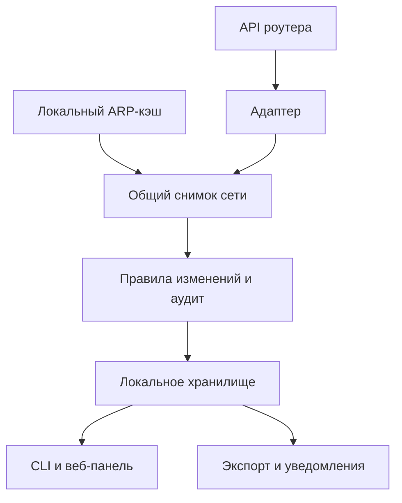

# Архитектура LANwatch

## Назначение

LANwatch — локальный монитор состояния и безопасности небольшой сети. Он получает доступные сведения от роутера, приводит их к общей модели, сравнивает текущий снимок с доверенной базой и предыдущим состоянием, сохраняет события локально и показывает их в CLI или локальной веб-панели.

Проект придерживается четырёх основных принципов:

- **read-only по отношению к роутеру** — LANwatch не меняет конфигурацию и не выполняет административные действия;
- **local-first** — состояние, история и интерфейс по умолчанию остаются на компьютере пользователя;
- **минимальные привилегии** — для запуска не требуются root или права администратора;
- **явные ограничения** — неизвестная или недоступная проверка получает состояние `UNKNOWN`, а не считается безопасной.

## Поток данных

1. Адаптер читает только разрешённые сведения из локального API роутера.
2. Данные разных моделей приводятся к общей схеме снимка сети.
3. При необходимости снимок дополняется уже существующими записями ARP/neighbor-кэша ОС.
4. Детекторы сравнивают новый снимок с доверенной базой и предыдущим состоянием.
5. События и снимки сохраняются локально.
6. Результат выводится в терминал или на локальную веб-панель.
7. Только по явному запросу пользователя события экспортируются в файл или отдельные метаданные отправляются через webhook/Telegram.

## Основные компоненты

| Компонент | Ответственность |
| --- | --- |
| `lanwatch/adapters/base.py` | Общий контракт адаптеров роутеров |
| `lanwatch/adapters/miwifi.py` | Чтение поддерживаемых данных Xiaomi MiWiFi |
| `lanwatch/adapters/openwrt.py` | Read-only обращения к OpenWrt через `ubus` |
| `lanwatch/client.py` | Сетевое взаимодействие с локальным API роутера |
| `lanwatch/models.py` | Общие модели снимков, устройств и событий |
| `lanwatch/local_discovery.py` | Пассивное чтение ARP/neighbor-кэша ОС |
| `lanwatch/detectors.py` | Обнаружение изменений между состояниями сети |
| `lanwatch/security_audit.py` | Консервативный read-only аудит доступных настроек |
| `lanwatch/storage.py` | Локальное состояние и история в SQLite/файлах |
| `lanwatch/exports.py` | Экспорт событий в JSONL, syslog и CEF |
| `lanwatch/notifications.py` | Выключенные по умолчанию webhook и Telegram-уведомления |
| `lanwatch/web.py` | Веб-панель, доступная только через loopback |
| `lanwatch/probe.py` | Минимальная диагностика совместимости без сетевых идентификаторов |
| `lanwatch/cli.py` | Команды `demo`, `enroll`, `check`, `monitor`, `audit`, `export`, `probe` и `web` |

## Границы доверия

### Роутер и локальная сеть

Ответ API считается внешним вводом. Клиент принимает только локальные IP-адреса и не следует HTTP-перенаправлениям. Для OpenWrt по умолчанию требуется HTTPS; небезопасный HTTP разрешается только отдельным флагом пользователя.

### Компьютер с LANwatch

Доверенная база, последний снимок, история SQLite и локальная OUI-база находятся в пользовательском каталоге `.lanwatch/`. Пароли и токены авторизации роутера на диск не записываются.

### Локальный браузер

Веб-панель привязана к `127.0.0.1`. Запуск на `0.0.0.0` отклоняется. Интерфейс использует проверку `Host`, случайный CSRF-токен, CSP, экранирование данных и запрет кэширования.

### Внешние сервисы

По умолчанию LANwatch ничего не отправляет наружу. Загрузка OUI-базы, webhook и Telegram включаются отдельными действиями пользователя. Уведомления содержат только уровень, тип и заголовок события.

## Добавление нового роутера

Новый роутер подключается отдельным адаптером, который реализует общий read-only контракт и возвращает нормализованный снимок. Адаптер не должен выполнять сканирование подсети, менять настройки, устанавливать пакеты на роутер или запрашивать доступ шире необходимого.

Порядок добавления модели и безопасной подготовки диагностических данных описан в [`ADD_ROUTER.md`](ADD_ROUTER.md). Матрица подтверждённой совместимости находится в [`COMPATIBILITY.md`](COMPATIBILITY.md).

## Намеренные ограничения

LANwatch не является SIEM, IDS/IPS, антивирусом или анализатором всего сетевого трафика. Он видит только данные, доступные через конкретный API роутера и локальный ARP-кэш. Проект не заявляет обнаружение вредоносного ПО, сканирования портов или всех возможных атак.
